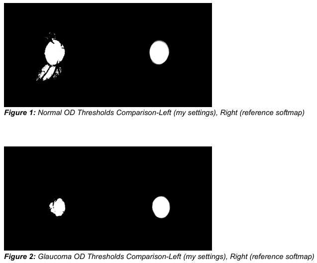
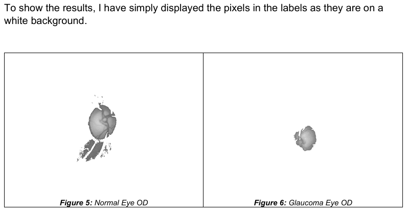

# Fundus-CCA-Segmentation
An automated medical image processing pipeline implemented in Python and OpenCV to isolate the Optic Disc and Cup from retinal fundus images. This project applies core Digital Image Processing concepts, including Connected Component Analysis (CCA) and intensity-based thresholding, to calculate clinical metrics for Glaucoma detection.<br>

🚀 Features:<br>
1. Automated segmentation of the Optic Nerve Head (ONH) using 8-connectivity based Connected Component Analysis.<br>
2. Intelligent V-set design to differentiate between the Optic Cup (brightest core) and the outer Optic Disc.<br>
3. Quantitative performance validation using Dice Coefficient calculations against expert ground truth masks.<br>
4. Pixel-wise accuracy tracking to identify True and False classification overlaps within the dataset.<br>

🔧 Technology Stack<br>
1. Python – Core programming language used for the segmentation logic and data handling.<br>
2. OpenCV & NumPy – Utilized for image transformations, matrix-based operations, and grayscale analysis.<br>
3. Connected Component Labeling (CCL) – The primary algorithmic approach for isolating nested anatomical structures.<br>
4. Drishti-GS/Retinal Dataset – High-resolution fundus images and manually annotated masks used for training and testing.<br>


## Badges

[](https://opensource.org/licenses/)


## Authors

- [@usmanawan50](https://github.com/usmanawan50/usmanawan50.git)

## Deployment

Clone this repository to vs code and open with live server:

### cmd
```bash
  git clone url
  pip install opencv-python numpy pandas
```
### scripts summary
```bash
  ThreshTestOD.py  = Testing script to design V-set for OD region.
  ThreshTestCup.py = Testing script to design V-set for Cup region.
  MyFunctions.py   = Function definitions used in the program.
  mainRoutine.py   = demo script for complete image processing.
  MainScript.py    = main script to process all images.
```

## Dataset
Use this [link](https://www.kaggle.com/datasets/lokeshsaipureddi/drishtigs-retina-dataset-for-onh-segmentation/data) or run the following script to get the dataset used directly from Kaggle:<br>
```bash
  import kagglehub

  # Download latest version
  path = kagglehub.dataset_download("lokeshsaipureddi/drishtigs-retina-dataset-for-onh-segmentation")
  print("Path to dataset files:", path)
```

## FAQ

#### How is the V-set determined?

The V-set is designed by analyzing intensity values from the training folder to intelligently separate the foreground components from the background.

#### What metrics are used for accuracy?

The pipeline computes the Dice Coefficient for three classes: background, Optic Cup, and Optic Disc, by comparing segmented labels to ground truth masks.


## Usage/Examples

<br><br>

The project report contains a detailed and thorough walkthrough of the project. Refer to it for further queries.
<br>(Chrome browser)

